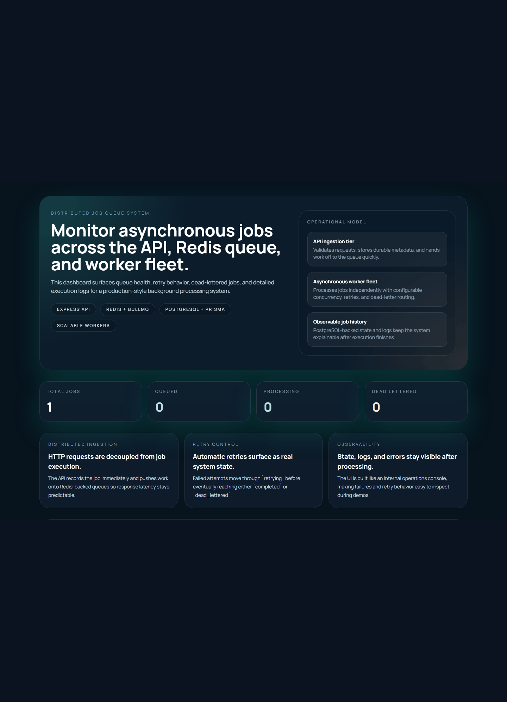
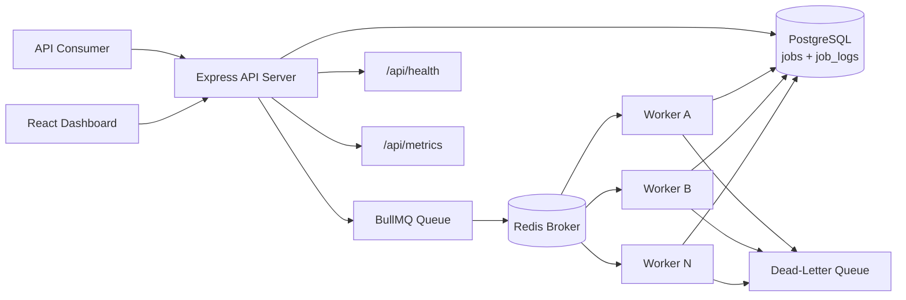
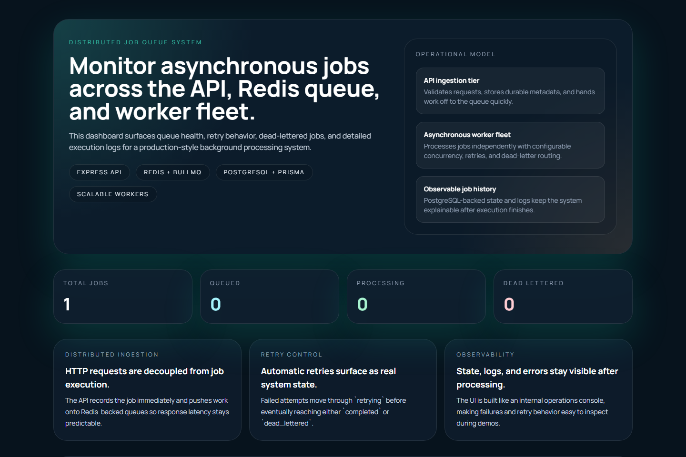

# Distributed Job Queue System


A production-style queue platform that models how backend systems accept long-running work, persist durable state, distribute jobs asynchronously, and expose operator visibility through an internal dashboard.

## Why I Built This

Many backend portfolios stay inside CRUD. Real systems do not.

I built this project to demonstrate a more practical platform problem:

How do you accept work without blocking requests, retry failures safely, preserve operational history, and give humans a clear control surface when things go wrong?

That is the problem this repository is built around.

## What It Demonstrates

- queue-based asynchronous processing
- a clean split between API, worker, broker, storage, and UI
- retries with exponential backoff
- dead-letter handling as an explicit system state
- durable job history and structured operational logs
- a dashboard designed for operators, not just for screenshots

## Demo



- Video placeholder: [`docs/videos/demo.mp4`](./docs/videos/demo.mp4)

### Suggested Walkthrough

1. Start the stack with Docker Compose.
2. Open the dashboard and show seeded jobs in different states.
3. Create a new job from the API.
4. Watch workers process it asynchronously.
5. Open a failed or dead-lettered job and trigger a manual retry.
6. Show health and metrics endpoints to explain observability.

### Demo Assets

- Screenshot placeholders live in [`docs/screenshots`](./docs/screenshots/README.md)
- Video capture notes live in [`docs/videos`](./docs/videos/README.md)

## Architecture



## System Walkthrough

1. A client sends a job request to `POST /api/jobs`.
2. The API validates the payload and persists a new job row in PostgreSQL.
3. The API pushes the job into BullMQ on top of Redis and returns a tracking id immediately.
4. A worker pulls the job asynchronously, marks it `processing`, and executes the correct processor.
5. The worker writes status transitions, results, and logs back to PostgreSQL.
6. If processing fails, BullMQ retries with exponential backoff.
7. If retries are exhausted, the job is marked `dead_lettered` and copied into a dedicated dead-letter queue.
8. The dashboard reads durable state from PostgreSQL so operators can inspect the system after execution.

## Recruiter-Friendly Highlights

- This is not a request-response CRUD app.
- It shows the difference between queue state and durable application state.
- It surfaces failures as first-class behavior instead of hiding them.
- It demonstrates backend design, operational thinking, and a product-minded UI in one repo.

## Tech Stack

### Backend

- Node.js
- TypeScript
- Express
- PostgreSQL
- Prisma ORM
- Redis
- BullMQ
- Pino
- Prometheus-style metrics with `prom-client`

### Frontend

- React
- Vite
- TypeScript
- Tailwind CSS
- TanStack Query

### Tooling

- Docker
- Docker Compose
- ESLint
- Prettier
- Vitest
- Supertest

## Supported Job Types

- `email_simulation`
- `image_processing_simulation`
- `report_generation`

These are simulated processors so the platform runs locally without third-party providers, but the processor boundary is deliberately structured so real integrations can replace them later.

## Job Lifecycle

Supported statuses:

- `pending`
- `queued`
- `processing`
- `completed`
- `failed`
- `retrying`
- `dead_lettered`

## Scaling Decisions

### 1. API and worker are separate runtimes

The API accepts work and returns quickly. Workers handle execution. That separation keeps HTTP latency independent from job duration and gives the system an obvious scaling path.

### 2. Redis for queue delivery, PostgreSQL for durable truth

Redis is excellent at fast queue coordination. PostgreSQL is better for durable records, queryability, auditability, and reporting. The project intentionally uses both because they solve different problems.

### 3. BullMQ instead of hand-rolled retry orchestration

BullMQ gives retries, concurrency controls, backoff, and worker lifecycle primitives with far less custom failure logic. For this scope, that trade is more pragmatic than building queue orchestration from scratch.

### 4. Dashboard as an operator interface

The dashboard is not decorative. It is there to expose the system states that matter:

- processing,
- retrying,
- failed,
- dead-lettered,
- retried,
- deleted.

That turns architecture into something you can actually inspect and explain.

## Screenshots



Screenshot guide: [`docs/screenshots/README.md`](./docs/screenshots/README.md)

## Tradeoffs

### Chosen now: one queue platform, not a fleet of services

This system is intentionally smaller than a true multi-tenant production platform. It focuses on the core asynchronous workflow before adding auth domains, tenant boundaries, external schedulers, or event buses.

### Chosen now: polling-style dashboard refresh instead of live push

The project leaves room for SSE or WebSocket updates later. For this version, simpler dashboard refresh behavior keeps the platform easier to run and explain locally.

### Chosen now: simulated processors instead of vendor integrations

Real email, media, and reporting vendors would add realism, but they would also shift the repo toward provider setup instead of system design. Simulated processors keep the engineering lesson focused on queue architecture.

## Failure Handling Strategy

- Each job has a configurable max attempt count.
- BullMQ applies exponential backoff between retries.
- On a failed attempt, the worker persists `retrying` and the next retry timestamp.
- When the retry budget is exhausted, the job is marked `dead_lettered`.
- Dead-lettered jobs remain visible in the API and dashboard and can be retried manually.
- Structured logs are stored for receipt, queueing, start, retry, completion, failure, and dead-letter events.

## Realistic Seed Data

The seed script creates operationally meaningful scenarios instead of filler records:

- high-priority onboarding email
- delayed marketing digest email
- image processing task that succeeds after one retry
- large report generation workload
- standard report generation workload
- image processing task that exhausts retries and lands in the dead-letter queue

Run it with:

```bash
npm run seed
```

## Quick Start

### 1. Clone and install

```bash
git clone https://github.com/mehmetalisahingm/distributed-job-queue-system.git
cd distributed-job-queue-system
npm install
```

### 2. Start with Docker Compose

```bash
docker compose up --build
```

Available services:

- Dashboard: `http://localhost:3000`
- API: `http://localhost:4000`
- Health: `http://localhost:4000/api/health`
- Metrics: `http://localhost:4000/api/metrics`

If `5432` is already occupied on your machine, set a different host port in `.env`:

```env
POSTGRES_HOST_PORT=5433
```

### 3. Seed demo jobs

```bash
npm run seed
```

### 4. Start services separately if needed

```bash
npm run dev:api
npm run dev:worker
npm run dev:web
```

## API Endpoints

| Method | Endpoint | Description |
| --- | --- | --- |
| `POST` | `/api/jobs` | Create a job and enqueue it |
| `GET` | `/api/jobs` | List jobs with optional `status` and `type` filters |
| `GET` | `/api/jobs/:id` | Fetch a single job |
| `GET` | `/api/jobs/:id/logs` | Fetch logs for a specific job |
| `POST` | `/api/jobs/:id/retry` | Retry a failed or dead-lettered job |
| `DELETE` | `/api/jobs/:id` | Delete a non-processing job |
| `GET` | `/api/health` | Check PostgreSQL and Redis connectivity |
| `GET` | `/api/metrics` | Expose Prometheus-style metrics |

## Example Request

```bash
curl -X POST http://localhost:4000/api/jobs \
  -H "Content-Type: application/json" \
  -d '{
    "type": "report_generation",
    "payload": {
      "reportName": "Weekly Operations Summary",
      "requestedBy": "portfolio-demo",
      "department": "operations",
      "rowsAnalyzed": 5400,
      "format": "pdf"
    },
    "priority": 5
  }'
```

## Project Structure

```text
.
|-- docker-compose.yml
|-- services
|   |-- backend
|   |   |-- prisma
|   |   |-- src
|   |   |   |-- api
|   |   |   |-- config
|   |   |   |-- db
|   |   |   |-- queue
|   |   |   |-- scripts
|   |   |   |-- services
|   |   |   |-- shared
|   |   |   `-- worker
|   |   `-- tests
|   `-- web
|       `-- src
`-- docs
```

## Development Checks

```bash
npm run lint
npm run typecheck
npm test
npm run build --workspace @distributed-job-queue/web
```

## Interview Narrative

Short version:

> I built this to show how asynchronous backend systems really behave. The API accepts work without blocking, Redis and BullMQ coordinate execution, workers process jobs independently, PostgreSQL stores durable state and logs, and the dashboard makes retries and dead-letter behavior visible to operators.
