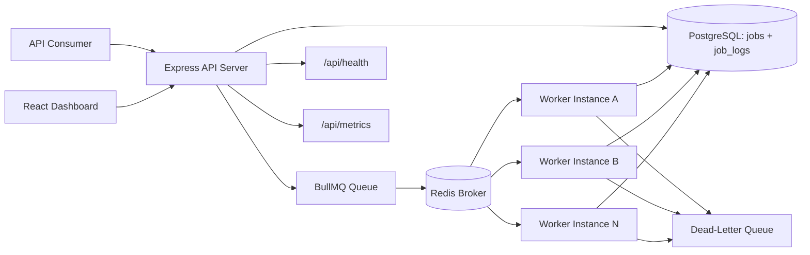

# Distributed Job Queue System

A production-style full-stack portfolio project that models how a real backend platform accepts background work, persists it, distributes it through a queue, processes it asynchronously, and exposes operational visibility through an API and dashboard.

This project is intentionally scoped for local development, but the architecture is organized the way a production system would grow: decoupled ingestion, durable state in PostgreSQL, Redis-backed queueing, independently scalable workers, structured logging, retries, dead-letter handling, and a UI focused on observability.

## Recruiter Summary

This repository demonstrates that I can:

- design a queue-based distributed workflow end to end
- separate API, worker, database, and broker responsibilities cleanly
- implement retry, failure, and dead-letter behavior instead of only happy-path CRUD
- build a modern interface for system visibility, not just a raw backend
- make the system runnable locally with Docker while keeping the code organized for future production growth

## What This Project Demonstrates

- Distributed systems basics: decoupling request/response flows from background execution
- Queue-based architecture: Redis + BullMQ for asynchronous job delivery
- Reliable background processing: retries, exponential backoff, and dead-letter handling
- Operational observability: logs, health checks, metrics, and status dashboards
- Practical backend engineering: schema design, service boundaries, worker orchestration, and typed APIs
- Full-stack product thinking: backend capabilities are surfaced through a UI that makes the system explainable

## Architecture



## System Walkthrough

1. A client submits a job through `POST /api/jobs`.
2. The API validates the request, stores a job record in PostgreSQL, and enqueues it through BullMQ.
3. A worker picks up the job asynchronously from Redis.
4. The worker marks the job as `processing`, runs the processor, and writes logs and status updates back to PostgreSQL.
5. On success, the job becomes `completed` with a stored result payload.
6. On failure, BullMQ retries the job with exponential backoff.
7. If the retry budget is exhausted, the job is marked `dead_lettered` and copied into a dead-letter queue.
8. The dashboard and API both read from PostgreSQL so job state is durable and queryable.

## Project Structure

```text
.
|-- docker-compose.yml
|-- services
|   |-- backend
|   |   |-- prisma
|   |   |-- src
|   |   |   |-- api
|   |   |   |-- config
|   |   |   |-- db
|   |   |   |-- queue
|   |   |   |-- scripts
|   |   |   |-- services
|   |   |   |-- shared
|   |   |   `-- worker
|   |   `-- tests
|   `-- web
|       `-- src
`-- docs
    `-- screenshots
```

## Key Design Decisions

- One backend codebase, two runtime entrypoints: the API server and worker share queue/database modules, but run as independent processes and containers.
- PostgreSQL is the source of truth: BullMQ manages delivery and retries, while PostgreSQL stores durable job state, searchable metadata, and execution logs.
- Worker processors are isolated from transport concerns: job type handlers focus on business logic and can later be swapped from simulation to real integrations.
- Failure states are first-class: `retrying`, `failed`, and `dead_lettered` are stored explicitly so the system is observable, not opaque.
- The frontend is an operator dashboard: it is designed to help explain the system during demos and interviews, not just to satisfy a UI requirement.

## Tech Stack

### Backend

- Node.js
- TypeScript
- Express.js
- PostgreSQL
- Prisma ORM
- Redis
- BullMQ
- Pino
- Prometheus-style metrics with `prom-client`

### Frontend

- React
- Vite
- TypeScript
- Tailwind CSS
- TanStack Query

### Tooling

- Docker
- Docker Compose
- ESLint
- Prettier
- Vitest
- Supertest

## Supported Job Types

- `email_simulation`
- `image_processing_simulation`
- `report_generation`

These use realistic simulation logic so the system runs locally without external providers, while still keeping extension points obvious for real email, media, or analytics services.

## Job Lifecycle

Statuses:

- `pending`
- `queued`
- `processing`
- `completed`
- `failed`
- `retrying`
- `dead_lettered`

## Failure Handling Strategy

- Every queued job is configured with a maximum attempt count.
- BullMQ applies exponential backoff between attempts.
- The worker persists `retrying` state and the next retry timestamp after each failed attempt.
- When the last allowed attempt fails, the worker records the error, marks the job as `failed`, then moves it to `dead_lettered`.
- Dead-lettered jobs stay visible in the dashboard and can be manually retried through `POST /api/jobs/:id/retry`.
- Structured logs are written for job receipt, queueing, start, retry, completion, failure, and dead-letter events.

## Scalability Considerations

- Workers scale horizontally: more worker containers can be added with `docker compose --scale worker=N`.
- Worker concurrency is configurable with `WORKER_CONCURRENCY`, allowing each instance to process multiple jobs in parallel.
- The API remains lightweight because long-running work is pushed to the queue immediately instead of blocking HTTP requests.
- Redis handles fast queue operations while PostgreSQL handles queryable historical state, reducing read/write coupling.
- Job processors are already separated by type, which makes it straightforward to split high-volume workloads into dedicated queues later.
- Metrics and health endpoints provide a foundation for autoscaling, alerting, and infrastructure-level monitoring in a larger deployment.

## Dashboard

The dashboard is designed to look like an internal operations console rather than a tutorial demo.

It includes:

- live job list with status and retry visibility
- filter controls for status and job type
- operational summary cards
- detailed drill-down drawer with payload, result, timestamps, and logs
- manual retry and delete actions
- clear error and loading states

## Realistic Seed Data

The seed script creates multiple operational scenarios instead of generic placeholder jobs:

- high-priority onboarding email
- delayed marketing digest email
- image processing task that succeeds after one retry
- large report generation workload
- normal report generation task
- image processing task that exhausts retries and ends up dead-lettered

Run it with:

```bash
npm run seed
```

Tip: start the worker first so you can watch jobs move through `queued`, `processing`, `retrying`, `completed`, and `dead_lettered`.

## Local Setup

### Prerequisites

- Node.js 22+
- Docker Desktop or Docker Engine

### Environment Files

```powershell
Copy-Item .env.example .env
Copy-Item services/backend/.env.example services/backend/.env
Copy-Item services/web/.env.example services/web/.env
```

### Run With Docker Compose

```bash
docker compose up --build
```

Services:

- Dashboard: `http://localhost:3000`
- API: `http://localhost:4000`
- Health: `http://localhost:4000/api/health`
- Metrics: `http://localhost:4000/api/metrics`

Scale workers:

```bash
docker compose up --build --scale worker=3
```

### Run Without Docker

1. Start PostgreSQL and Redis locally.
2. Install dependencies and generate Prisma client:

```bash
npm install
npm run db:generate
```

3. Apply the migration:

```bash
npm run db:migrate
```

4. Start each service:

```bash
npm run dev:api
npm run dev:worker
npm run dev:web
```

5. Seed demo jobs:

```bash
npm run seed
```

## API Endpoints

| Method | Endpoint | Description |
| --- | --- | --- |
| `POST` | `/api/jobs` | Create a job and enqueue it |
| `GET` | `/api/jobs` | List jobs with optional `status` and `type` filters |
| `GET` | `/api/jobs/:id` | Get a single job |
| `GET` | `/api/jobs/:id/logs` | Get execution logs for a job |
| `POST` | `/api/jobs/:id/retry` | Requeue a failed or dead-lettered job |
| `DELETE` | `/api/jobs/:id` | Delete a non-processing job |
| `GET` | `/api/health` | Check Redis and PostgreSQL connectivity |
| `GET` | `/api/metrics` | Expose Prometheus-style metrics |

## Example Request

```bash
curl -X POST http://localhost:4000/api/jobs \
  -H "Content-Type: application/json" \
  -d '{
    "type": "report_generation",
    "payload": {
      "reportName": "Weekly Operations Summary",
      "requestedBy": "portfolio-demo",
      "department": "operations",
      "rowsAnalyzed": 5400,
      "format": "pdf"
    },
    "priority": 5
  }'
```

Example response:

```json
{
  "data": {
    "id": "6e2467db-2d95-4a54-b5af-2a6c8dff2b08",
    "status": "queued",
    "createdAt": "2026-04-11T18:10:32.401Z"
  }
}
```

## Development Checks

```bash
npm run lint
npm run typecheck
npm test
npm run build --workspace @distributed-job-queue/web
```

## Technical Interview Talking Points

If I were explaining this project in an interview, I would focus on:

- why the system separates synchronous API handling from asynchronous execution
- why queue state and durable business state are not the same thing
- how retries are coordinated between BullMQ and the persisted job record
- why dead-lettering matters for operational safety
- how I would scale workers separately from the API tier
- how I would evolve the simulated processors into real integrations
- what tradeoffs I made to keep the system locally manageable without making the design toy-like

## Future Improvements

- per-tenant queues and authentication
- scheduled jobs and recurring workflows
- server-sent events or WebSockets for live dashboard updates
- OpenTelemetry tracing across API and workers
- worker-specific metrics and alerting
- queue partitioning by workload class
- S3 or object storage integration for large result artifacts
- retention policies and archival for old job records

## Screenshot Placeholders

- [`docs/screenshots/dashboard-overview.png`](./docs/screenshots/dashboard-overview.png)
- [`docs/screenshots/job-detail-drawer.png`](./docs/screenshots/job-detail-drawer.png)
- [`docs/screenshots/compose-services.png`](./docs/screenshots/compose-services.png)
