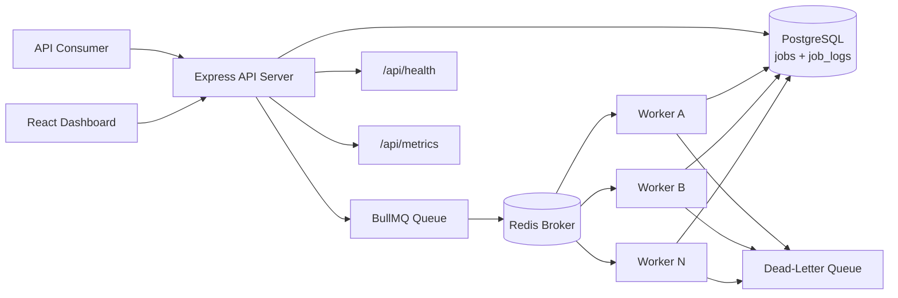

# Distributed Job Queue System


A production-style full-stack portfolio project that models how a real backend platform accepts background work, stores durable job state, distributes jobs through a Redis-backed queue, processes them asynchronously with workers, and exposes operational visibility through an API and dashboard.

This project is intentionally manageable for local development, but it is structured the way a real system would grow in production: decoupled ingestion, durable persistence, independently scalable workers, retry and dead-letter handling, metrics, health checks, and an operator-facing dashboard.

## Portfolio Snapshot

- Queue-based distributed workflow with clear API, worker, database, and broker boundaries
- Real retry behavior with exponential backoff and explicit dead-letter handling
- PostgreSQL used as the durable source of truth for job history and logs
- Redis + BullMQ used for asynchronous delivery and execution flow
- Modern React dashboard designed like an internal operations console
- Docker Compose setup for fast local evaluation and demoing

## Why This Project Matters

Most beginner backend projects stop at CRUD. This one focuses on a more realistic engineering problem:

How do you accept long-running or failure-prone work without blocking HTTP requests, while still keeping the system observable, debuggable, and scalable?

That is the core problem this repository solves.

## What This Project Demonstrates

- Distributed systems basics through queue-driven asynchronous processing
- Separation of concerns between ingestion, execution, persistence, and presentation
- Practical reliability patterns such as retries, exponential backoff, and dead-letter queues
- Production-minded backend design with health checks, metrics, logging, and typed contracts
- Full-stack system design where backend behavior is surfaced clearly in a usable UI
- A codebase that is strong enough for technical discussion in interviews

## Architecture



## System Walkthrough

1. A client sends a job request to `POST /api/jobs`.
2. The API validates the payload and persists a new job row in PostgreSQL.
3. The API pushes the job into BullMQ on top of Redis and returns a tracking id immediately.
4. A worker pulls the job asynchronously, marks it `processing`, and executes the correct processor.
5. The worker writes status transitions, results, and logs back to PostgreSQL.
6. If processing fails, BullMQ retries with exponential backoff.
7. If retries are exhausted, the job is marked `dead_lettered` and copied into a dedicated dead-letter queue.
8. The dashboard and API read durable state from PostgreSQL so the system remains queryable after execution.

## Recruiter-Friendly Highlights

- This is not a toy request-response app; it models asynchronous system behavior.
- It shows that I understand the difference between queue state and durable application state.
- It demonstrates operational thinking: failure modes are visible, not hidden.
- It is built to be easy to run locally without giving up architectural clarity.

## Tech Stack

### Backend

- Node.js
- TypeScript
- Express.js
- PostgreSQL
- Prisma ORM
- Redis
- BullMQ
- Pino
- Prometheus-style metrics with `prom-client`

### Frontend

- React
- Vite
- TypeScript
- Tailwind CSS
- TanStack Query

### Tooling

- Docker
- Docker Compose
- ESLint
- Prettier
- Vitest
- Supertest

## Supported Job Types

- `email_simulation`
- `image_processing_simulation`
- `report_generation`

These are simulated processors so the project runs locally without third-party providers, but the processor layer is structured so real integrations can be added later.

## Job Lifecycle

Supported statuses:

- `pending`
- `queued`
- `processing`
- `completed`
- `failed`
- `retrying`
- `dead_lettered`

## Failure Handling Strategy

- Each job is created with a configurable max attempt count.
- BullMQ applies exponential backoff between retries.
- On a failed attempt, the worker persists `retrying` plus the next retry timestamp.
- When the retry budget is exhausted, the worker records the error and marks the job `dead_lettered`.
- Dead-lettered jobs remain visible in the API and dashboard and can be retried manually.
- Structured logs are stored for job receipt, queueing, start, retry, completion, failure, and dead-letter events.

## Scalability Considerations

- The API and worker are separate runtimes, so they can scale independently.
- Workers support configurable concurrency with `WORKER_CONCURRENCY`.
- Multiple worker containers can be added with `docker compose --scale worker=N`.
- Redis handles fast queue operations while PostgreSQL stores durable, queryable state.
- Job processors are isolated by type, making it straightforward to split workload classes into separate queues later.
- Health and metrics endpoints provide a base for alerting, autoscaling, and external observability tooling.

## Dashboard

The dashboard is intentionally designed like an internal ops console, not a generic CRUD table.

It includes:

- live job list with status visibility
- status and type filters
- operational summary cards
- job detail drawer with payload, result, timestamps, and logs
- manual retry and delete actions
- loading and failure states suitable for demos

## Realistic Seed Data

The seed script creates operationally meaningful scenarios instead of filler data:

- high-priority onboarding email
- delayed marketing digest email
- image processing task that succeeds after one retry
- large report generation workload
- standard report generation workload
- image processing task that exhausts retries and lands in the dead-letter queue

Run it with:

```bash
npm run seed
```

## Quick Start

### 1. Clone and install

```bash
git clone https://github.com/mehmetalisahingm/distributed-job-queue-system.git
cd distributed-job-queue-system
npm install
```

### 2. Start with Docker Compose

```bash
docker compose up --build
```

Available services:

- Dashboard: `http://localhost:3000`
- API: `http://localhost:4000`
- Health: `http://localhost:4000/api/health`
- Metrics: `http://localhost:4000/api/metrics`

If `5432` is already occupied on your machine, set a different host port in `.env`:

```env
POSTGRES_HOST_PORT=5433
```

### 3. Seed demo jobs

```bash
npm run seed
```

### 4. Scale workers

```bash
docker compose up --build --scale worker=3
```

## Local Development Without Docker

1. Start PostgreSQL and Redis locally.
2. Copy env files:

```powershell
Copy-Item .env.example .env
Copy-Item services/backend/.env.example services/backend/.env
Copy-Item services/web/.env.example services/web/.env
```

3. Generate Prisma client and apply migrations:

```bash
npm run db:generate
npm run db:migrate
```

4. Start each service in separate terminals:

```bash
npm run dev:api
```

```bash
npm run dev:worker
```

```bash
npm run dev:web
```

## API Endpoints

| Method | Endpoint | Description |
| --- | --- | --- |
| `POST` | `/api/jobs` | Create a job and enqueue it |
| `GET` | `/api/jobs` | List jobs with optional `status` and `type` filters |
| `GET` | `/api/jobs/:id` | Fetch a single job |
| `GET` | `/api/jobs/:id/logs` | Fetch logs for a specific job |
| `POST` | `/api/jobs/:id/retry` | Retry a failed or dead-lettered job |
| `DELETE` | `/api/jobs/:id` | Delete a non-processing job |
| `GET` | `/api/health` | Check PostgreSQL and Redis connectivity |
| `GET` | `/api/metrics` | Expose Prometheus-style metrics |

## Example Request

```bash
curl -X POST http://localhost:4000/api/jobs \
  -H "Content-Type: application/json" \
  -d '{
    "type": "report_generation",
    "payload": {
      "reportName": "Weekly Operations Summary",
      "requestedBy": "portfolio-demo",
      "department": "operations",
      "rowsAnalyzed": 5400,
      "format": "pdf"
    },
    "priority": 5
  }'
```

Example response:

```json
{
  "data": {
    "id": "6e2467db-2d95-4a54-b5af-2a6c8dff2b08",
    "status": "queued",
    "createdAt": "2026-04-11T18:10:32.401Z"
  }
}
```

## Project Structure

```text
.
|-- docker-compose.yml
|-- services
|   |-- backend
|   |   |-- prisma
|   |   |-- src
|   |   |   |-- api
|   |   |   |-- config
|   |   |   |-- db
|   |   |   |-- queue
|   |   |   |-- scripts
|   |   |   |-- services
|   |   |   |-- shared
|   |   |   `-- worker
|   |   `-- tests
|   `-- web
|       `-- src
`-- docs
    `-- screenshots
```

## Development Checks

```bash
npm run lint
npm run typecheck
npm test
npm run build --workspace @distributed-job-queue/web
```

## How To Explain This In An Interview

Use this short version:

"This project is a distributed background job system. The API accepts work and returns immediately, Redis and BullMQ handle asynchronous delivery, workers process jobs independently, PostgreSQL stores durable state and logs, and the dashboard exposes retries, failures, and dead-lettered jobs. I built it to show queue-based architecture, fault tolerance, and production-style backend design."

Technical talking points:

- why long-running work should be moved out of the request-response cycle
- why Redis is used for queue delivery while PostgreSQL stores durable state
- how retries and dead-letter behavior are modeled explicitly
- how API and worker scaling differ
- how simulated processors could be replaced with real integrations

## Future Improvements

- authentication and tenant isolation
- scheduled and recurring jobs
- SSE or WebSocket live updates
- OpenTelemetry tracing
- worker-specific metrics and alerting
- queue partitioning by workload type
- object storage integration for large artifacts
- archival and retention policies

## Screenshot Placeholders

- [`docs/screenshots/dashboard-overview.png`](./docs/screenshots/dashboard-overview.png)
- [`docs/screenshots/job-detail-drawer.png`](./docs/screenshots/job-detail-drawer.png)
- [`docs/screenshots/compose-services.png`](./docs/screenshots/compose-services.png)
